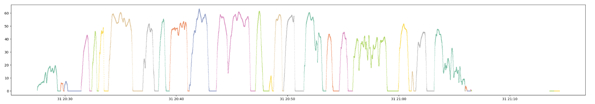
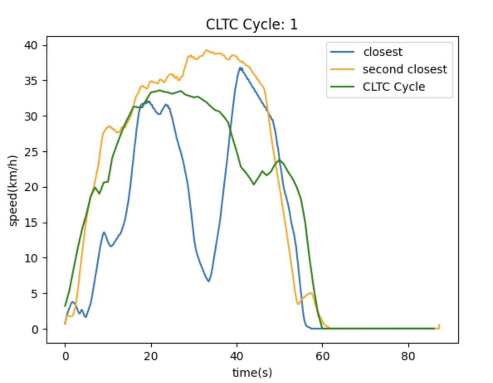

# VEE-Data-Processing
Jupyter notebooks for vehicle energy visualization and driving cycle clustering.

process MDF file to dataframe

separate driving history into cycles and use unsupervised clustering for idetifying the most similar driving cycle compared to CLTC standard.

